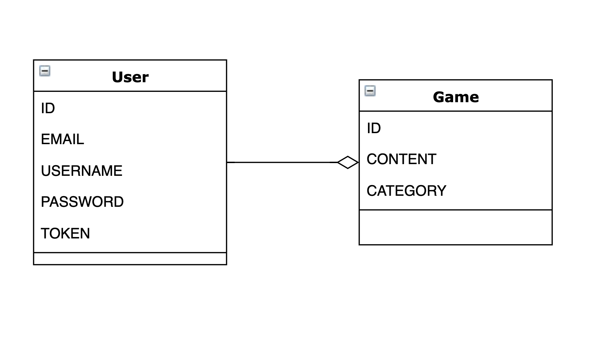
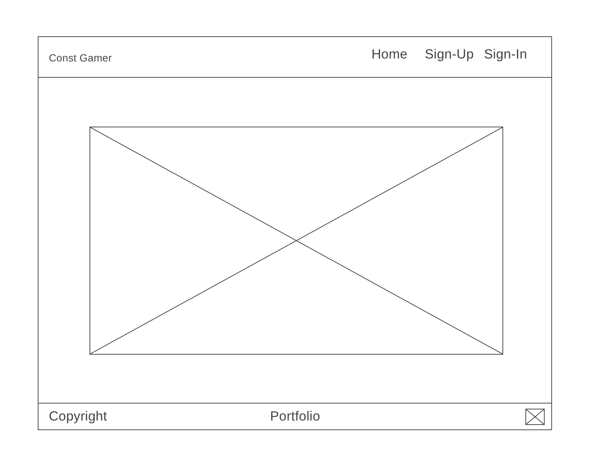
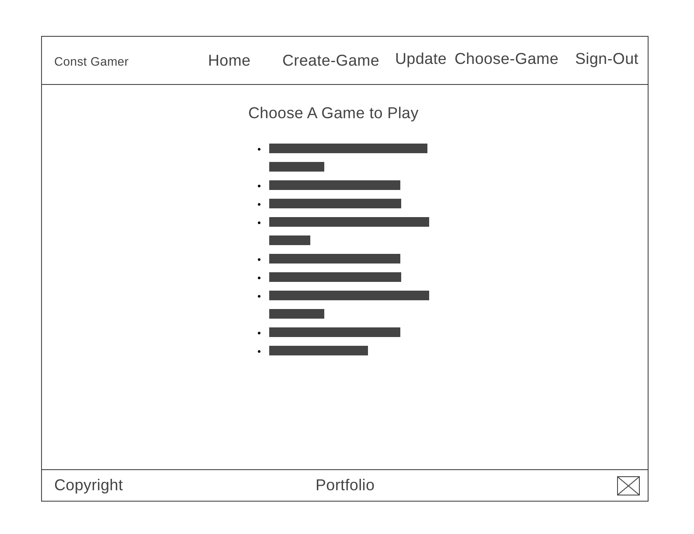
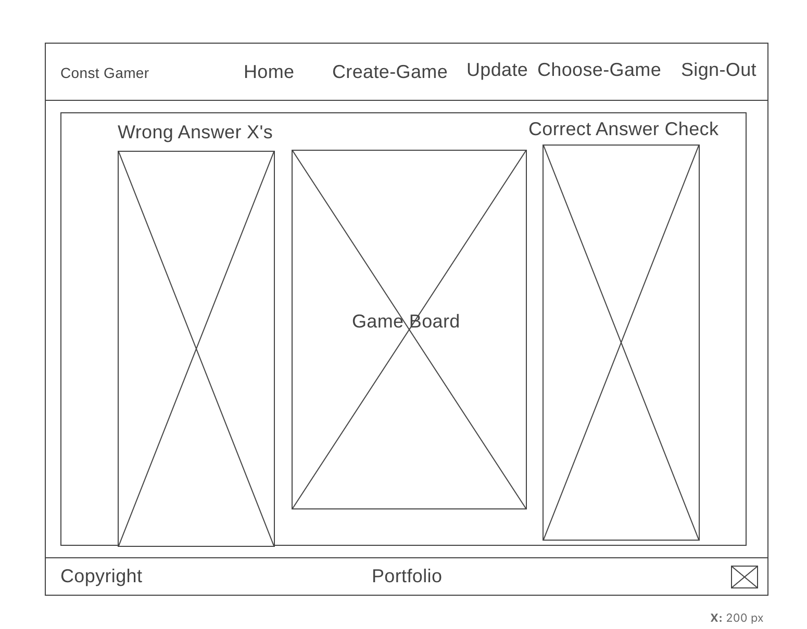

# Const Gamer

Const Gamer is a web application created for hosting multiple types of games. The client side of the application was built using [React.js](https://reactjs.org)
and the back-end was built using [Ruby on Rails](https://rubyonrails.org)
.
### Game Board View

### Game List View

## Important Links

[Const Gamer Api Repo](https://github.com/GMorse19/project4-api)

[Const Gamer Deployed API](https://gentle-beach-45706.herokuapp.com/)

[Const Gamer Deployed Client](https://gmorse19.github.io/project4-client/)

## Planning

This is my fourth and final project for [General Assembly's](https://generalassemb.ly) Full Stack Immersive program. The first thing I needed to decide for this project, was which framework to use. I opted to use React.js.

Having just recently learned React.js, I wanted to keep my first version of the project relatively basic. I also wanted to leave the door open to expand on the project as my comfort level within the framework grew.

To do this I decided upon a site that could host multiple types of games. I figured if all goes well, I can add an endless line of games to the app.

## ERD

## Wire Frames

#### Home Page

#### List Page

#### Game Board

## User Stories

#### Version 1
- As a user I would like to sign-up and sign-in - as a registered user with a username
- As a user I would like to choose a game to play
- As a user I would like to choose a challenge for the previously selected game
- As a user I would like to create a challenge for others to play
- As a user I would like the ability to delete a challenge that I’ve created
- As a user I would like the ability to update a challenge that I’ve created
- As a user I would like to view all challenges that others have created as well as my own
- As a user I would like the ability to change my password
- As a user I would like to sign-out

#### Version 2

- As a user I would like to count wins and losses
- As a user I would like to rate a game and/or a challenge
- As a user I would like to create a group of challenges to played against a timer
- As a user I would like to select a random puzzle
- As a user I would like to search by category

## Technologies Used

- React.js
- JavaScript
- Bootstrap
- HTML/CSS

## Catalog of Routes

| Verb  | URI Pattern     |
|-------|-----------------|
| GET   | /games          |
| GET   | /auth-games     |
| SHOW  | /games/:id      |
| SHOW  | /auth-games/:id |
| POST  | /create-game    |
| PATCH | /games/:id/edit |

## Installation

1. Fork and Clone this repository.
1. Install dependencies with `npm install`.
1. `git add` and `git commit` your changes.
1. Run the development server with `npm start`.

## Unsolved Problems

- The App needs more games
- I would like to refactor a lot of the code
- The styling needs a lot of work
- The Layout of the word game can be re-worked
- I would like to add a search function
- I would like to add a rating system

## [License](LICENSE)

1. All content is licensed under a CC­BY­NC­SA 4.0 license.
1. All software code is licensed under GNU GPLv3. For commercial use or
    alternative licensing, please contact legal@ga.co.
